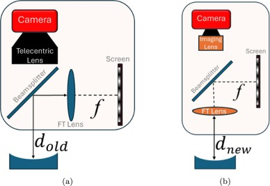

---

##### Download

+ [Paper](cpmd_II.pdf)


---

##### Abstract

Collimated phase measuring deflectometry (CPMD) is an optical metrology technique developed to improve upon traditional phase measuring deflectometry (PMD). CPMD utilizes telecentric imaging and collimated structured light illumination to eliminate the height-slope ambiguity present in traditional PMD measurements. After the publication of the first CPMD paper, efforts began to optimize the optical layout of the CPMD system. The first proposed change, and the one detailed in this work, was to move the Fourier transform (FT) lens closer to the surface under test (SUT). Moving the FT lens closer to the SUT meant that for a given FT lens diameter, a larger range of surface slopes on the SUT could be measured. This change to the optical layout was not trivial and introduced at least two concerns that had to be addressed: telecentricity in the imaging path and possible ghost reflections from the re-located FT lens. In this work, we examine how these concerns were addressed and present results showing that the revised optical layout is capable of measurement results at least as good as the original CPMD optical layout. We also demonstrate the increased slope measuring range of the revised optical layout.

---

##### Figure 1: Comparison of old (a) and revised (b) optical layouts



---

##### Citation

Corey Austin, Wanqi Shang, Lei Huang, Tianyi Wang, Carl Paterson, Peter Török, Mourad Idir,
Collimated phase measuring deflectometry II: Re-design of the optical layout for high-curvature surfaces,
Optics and Lasers in Engineering,
Volume 194,
2025,
109173,
ISSN 0143-8166,
https://doi.org/10.1016/j.optlaseng.2025.109173.

```BibTeX
@article{AUSTIN2025109173,
title = {Collimated phase measuring deflectometry II: Re-design of the optical layout for high-curvature surfaces},
journal = {Optics and Lasers in Engineering},
volume = {194},
pages = {109173},
year = {2025},
issn = {0143-8166},
doi = {https://doi.org/10.1016/j.optlaseng.2025.109173},
url = {https://www.sciencedirect.com/science/article/pii/S0143816625003586},
author = {Corey Austin and Wanqi Shang and Lei Huang and Tianyi Wang and Carl Paterson and Peter Török and Mourad Idir},
}
```

---