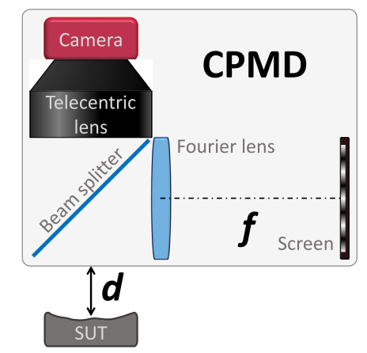

---

##### Download

+ [Paper](cpmd.pdf)


---

##### Abstract

Phase measuring deflectometry has been applied for free-form specular surface metrology, but its measured slope results are sensitive to the depth of sample positioning, which is also called the height-slope ambiguity. The objective of this work is to tackle this height-slope ambiguity problem. The main idea is to introduce collimated camera rays using a telecentric imaging lens and collimated structured-light illumination with a Fourier lens. This setup makes the fringe phases become only sensitive to the surface slopes and insensitive to the depth of the sample positioning. In this way, the slope calculation is theoretically independent of the sample depth. We call this new deflectometry technique Collimated Phase Measuring Deflectometry (CPMD). With our developed CPMD experimental setup, the measurement is insensitive to the depth of sample positioning, e.g., the measured height dispersion is less than 30 nm RMS within a 10 mm depth range when measuring a 50-mm-diameter spherical mirror with a 200 mm radius of curvature. The merits and limitations of the proposed CPMD technique are discussed, revealing its prospects in practical metrology applications and potential future investigations.

---

##### Figure 2:  The CPMD configuration utilizes two key components (a telecentric imaging lens and a Fourier lens) working together to realize the independence between the height reconstruction and the depth of sample positioning in theory.



---

##### Citation

Lei Huang, Tianyi Wang, Corey Austin, Lukas Lienhard, Yan Hu, Chao Zuo, Daewook Kim, Mourad Idir,
Collimated phase measuring deflectometry,
Optics and Lasers in Engineering,
Volume 172,
2024,
107882,
ISSN 0143-8166,
https://doi.org/10.1016/j.optlaseng.2023.107882.
(https://www.sciencedirect.com/science/article/pii/S0143816623004116)

```BibTeX
@article{HUANG2024107882,
title = {Collimated phase measuring deflectometry},
journal = {Optics and Lasers in Engineering},
volume = {172},
pages = {107882},
year = {2024},
issn = {0143-8166},
doi = {https://doi.org/10.1016/j.optlaseng.2023.107882},
url = {https://www.sciencedirect.com/science/article/pii/S0143816623004116},
author = {Lei Huang and Tianyi Wang and Corey Austin and Lukas Lienhard and Yan Hu and Chao Zuo and Daewook Kim and Mourad Idir},
}
```

---