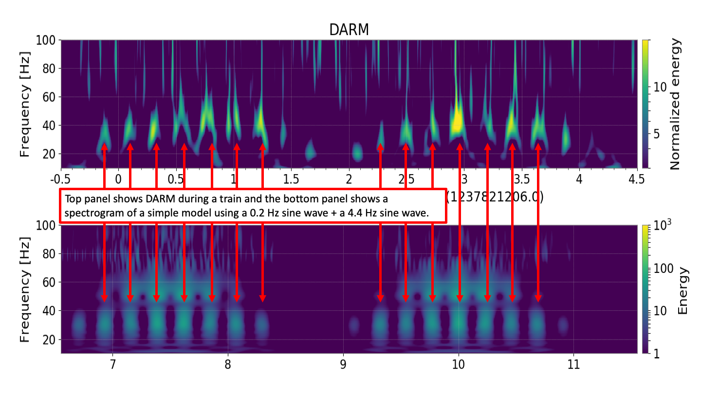

---

##### Download

+ [Paper](paper3.pdf)

---

##### Abstract

The Advanced LIGO (aLIGO) detectors use 1064 nm lasers to measure the tiny fluctua-
tions in spacetime that occur when gravitational waves pass through the earth. LIGO makes
use of advanced coating methods and materials to limit the amount of light that scatters
from the main beam, but some amount of light does scatter. This stray light can interact
with surfaces inside the interferometer that are not seismically isolated and then recombine
with the main beam, introducing excess noise into the gravitational wave channel. This the-
sis reviews the methods for modeling scattered light with ray tracing software and analytical
models, for measuring scattered light with driven measurements of the vacuum enclosure,
and for mitigating scattered light with baffles and changes to interferometer controls. It
also details the process for finding correlations with auxiliary sensors in order to locate the
sources of scattered light noise. The results of this work are improved sensitivity of the LIGO
detectors in the frequency band from 20 Hz up to 200 Hz

---

##### Figure 5.12: The top panel is a zoom in of the noise seen in Figure 5.11 and the bottom
##### panel is a spectrogram of a simple model that combines 0.2 Hz motion with 4.4 Hz motion
##### to obtain a similar shape to the noise seen in DARM.

---

##### Citation

Austin, Corey Daniel, "Measurements and Mitigation of Scattered Light Noise in LIGO" (2020). LSU
Doctoral Dissertations. 5419.

---